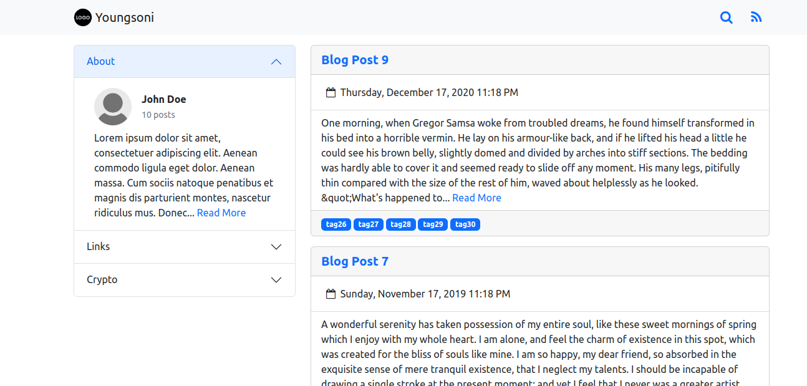
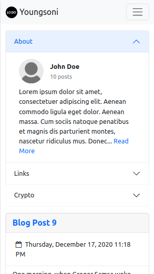

    

 <h3 align="center">Youngsoni</h3>
  

    A static site generator.
     
     
    <a href="https://github.com/ElijahToussaint/youngsoni/issues">Report Bug</a>
    ·
    <a href="https://github.com/ElijahToussaint/youngsoni/issues">Request Feature</a>
    ·
    <a href="https://github.com/ElijahToussaint/youngsoni/blob/main/RELEASES.md">Releases</a>
  

## About The Project

| Desktop   | Mobile    |
| :---:     | :---:     |
|  |  |

### What is a static site generator?

A static site generator is a tool that generates a full static HTML website based on raw data and a set of templates. Essentially, a static site generator automates the task of coding individual HTML pages and gets those pages ready to serve to users ahead of time.

### What is a static site?

A static site consists of a series of HTML files, each one representing a physical page of a website. On static sites, each page is a separate HTML file.

### Why is it called Youngsoni?

Youngsoni is the [lesser hairy-footed dunnart](https://en.wikipedia.org/wiki/Lesser_hairy-footed_dunnart) (Sminthopsis youngsoni), a small carnivorous Australian marsupial. It is a widespread and fairly common species, being found in many desert areas of Western Australia, Northern Territory and Queensland.

### Built With

- [Node.js](https://nodejs.org/en/)
- [Express](https://expressjs.com/)
- [Javascript](https://www.ecma-international.org/publications-and-standards/standards/ecma-262/)
- [Hjson](https://hjson.github.io/)
- [Nunjucks](https://mozilla.github.io/nunjucks/)

## Features

- Open source, [AGPL License](/LICENSE).
- Lightweight and easy to deploy.
- Clean, mobile-friendly interface.
- Supports seperate sections for personal links and cryptocurrencies.
- Pages are automatically paginated. Disabling and adjusting page size is all done through your [config](src/config/config.hjson) file
- A webserver is started so you can view your website in a browser.
- Support for the [Nunjucks](https://mozilla.github.io/nunjucks/) templating engine.
- The powerful and easy to learn [markdown](https://daringfireball.net/projects/markdown/) syntax is used for writing posts.
- RSS feeds are automatically generated.
- A web user interface that can create, edit and delete information for your site.
- Host anywhere static HTML is supported.

## Installation

Install dependencies:

`sudo apt install nodejs git`

`sudo apt install npm`

Clone the git repository:

`git clone https://github.com/ElijahToussaint/youngsoni`

Go into the directory:

`cd youngsoni`

Install node packages:

`npm install`

Generate site:

`./generate.sh`

Preview site on localhost:

`npm start`

To access the webui:

`http://localhost:{port}/webui`

## Configuration

Configuration files can be found in the [config](src/config) and [data](src/data) directories.

Post files are stored in the [posts](src/data/posts) directory and saved with the `.md` extension.

Refer to the example files in the [config](src/config/examples) and [data](src/data/examples) directories for examples.

All multimedia files referenced in the site should be stored in the public [assets](public/assets) directory. When referencing files on the site, format the path like this: `{path}/path/file.extension`. The `{path}` is a Nunjucks variable that references the relative path depth of the files.

All configuration files should be in [hjson](https://hjson.github.io/) format and saved with the `.hjson` extension.

## Customization

The appearence of the generated site can be modified by editing the [custom](public/css/custom.css) CSS file in the [public](public) directory.

Youngsoni uses [Bootstrap](https://github.com/twbs/bootstrap) for its frontend design. Learn to modify the CSS variables [here](https://getbootstrap.com/docs/5.0/customize/overview/). 

## Support / Donate

Youngsoni is free, open-source software. Donations directly support development of the project.

### Crypto

- Bitcoin (BTC): `bc1qrf2f64n4znghwvaxt3mf3jr82fxw9wf83w6xtg`
- Ethereum (ETH): `0xB07b8b081BAA0d6Ad5D072A3132FfFd289bc5dAF`
- Bitcoin Cash (BCH): `qqxveqvtefqx4aszn83euv7mdcd8mgtx3cr3vu85dk`
- Litecoin (LTC): `LQZCnoGLKyEpqw7jpKfc1qpYN1bwLvyTcS`
- Dogecoin (DOGE): `D8cBSTDAh4LXDxkHVN44Nnf3LECgTerNjx`
- Zcash (ZEC): `t1YKzhroHjPwUwc5uxU7t4RP2rCt6FDo2ee`
- Dash (DASH): `XfQ2kvpQBKWjiDpCUe7G4RukrQN2YvVy7Y`
- Monero (XMR): `44tUtL754iP1uM1Vet2uUqJtLNCfgDCdjFqtSjg58oUYT576G47xdzjYoRrFhUr66obzLtFuBprMjBt1YfiKy2SpAqocWS8`

## Contact

- [Email](mailto:elijahtoussaint@protonmail.com)

## Code Mirrors

- [GitHub](https://github.com/ElijahToussaint/youngsoni)
- [Codeberg](https://codeberg.org/ElijahToussaint/youngsoni)
